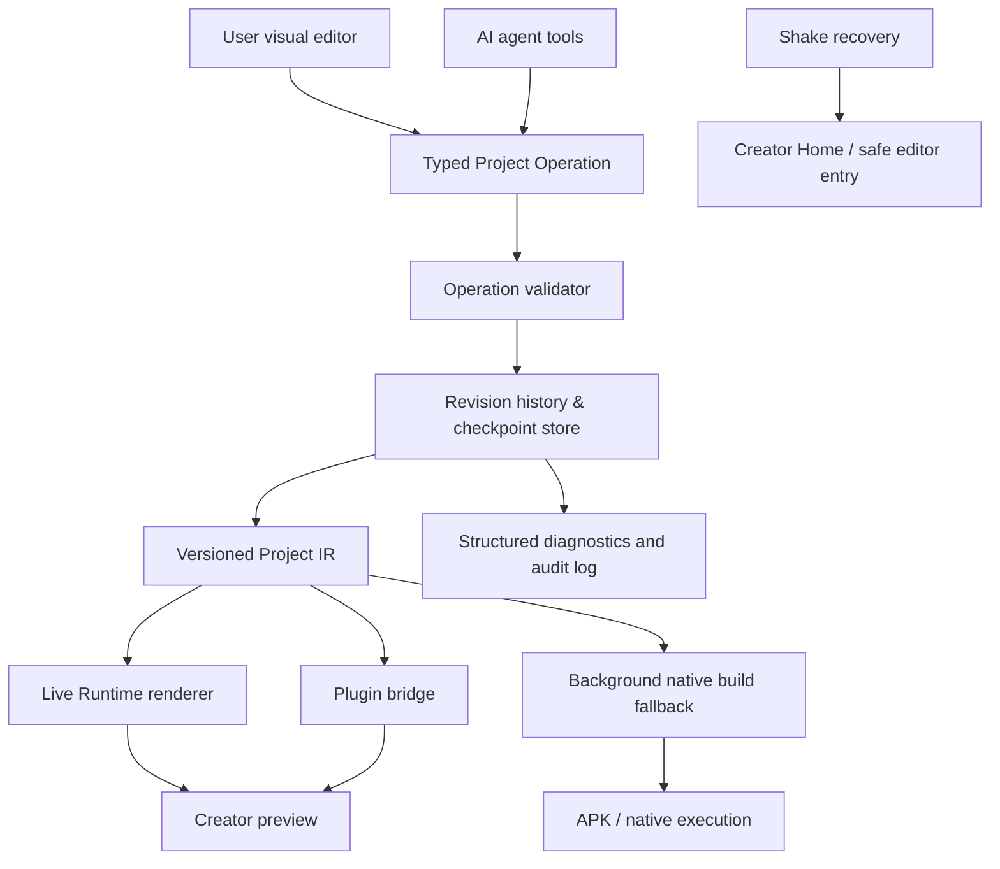

# Creator Runtime Charter

## 1. Product intent

Creator Runtime transforms Sketchware Pro from an editor that primarily produces compiled Android applications into a **transparent, live-editable application host**. A user opens a clean canvas, changes an application through visual controls or the AI agent, and immediately sees the new behavior. The same project model remains inspectable from start to finish: screens, widgets, blocks, data, resources, navigation, plugins, operations, and checkpoints.

The product is not an opaque self-modifying application. It is a **user-governed creation environment** where every visible behavior has a corresponding human-readable project operation. The AI has no privileged write path: it submits the same validated operations that the visual editor submits.

> **Primary promise:** A user can understand, inspect, change, undo, and recover every app behavior that Creator Runtime executes.

## 2. User experience contract

| Moment | User experience | System guarantee |
|---|---|---|
| Launch | A white Creator Home opens instead of the historical project list. | The original Sketchware project list remains available from the sidebar; no projects are hidden or deleted. |
| Enter a project | A circular editable entry control opens the active project canvas. | The control is rendered by the host safety layer and cannot permanently remove editor access. |
| Edit by hand or AI | A visual change appears in the live preview after validation. | Both paths create the same typed operation, revision, audit event, and undo checkpoint. |
| Return from editor | The user sees the live app preview instead of the original empty home. | The preview reflects the last committed project revision. |
| Recover access | The entry control may be moved or styled, but shaking the device opens Creator recovery. | The shake gesture and a reset-to-safe-layout action remain host-owned. |
| Need a native APK | The user can request an installable native build. | Compilation runs in the background from a known revision and never blocks or corrupts the live preview. |

## 3. Architecture decision

Creator Runtime uses a **hybrid, data-driven architecture**.



The host application is installed once. Projects are represented as versioned data and are rendered by the host immediately. Native Android compilation remains available for functionality that cannot safely be interpreted, but it is a compatibility path rather than the normal edit-preview loop.

## 4. Canonical Project IR

The **Project Intermediate Representation (Project IR)** becomes the single source of truth for Creator Runtime. It must be serializable, versioned, inspectable in the UI, and reversible through operations.

| IR domain | Initial representation | Required property |
|---|---|---|
| Project identity | `projectId`, name, icon, theme, runtime schema version | Stable and migratable |
| Screens | Screen IDs, root tree, route metadata, lifecycle events | Deterministic render order |
| Widgets | Type, ID, parent, properties, bindings, accessibility labels | Human-readable diff |
| State | Typed variables, lists, maps, persisted keys | Explicit scope and default values |
| Logic | Event graph and block graph | No hidden generated behavior |
| Navigation | Routes, parameters, entry screen, transitions | Validated cycles and targets |
| Resources | Logical references to images, icons, text, fonts, audio | Content-addressed integrity check |
| Plugins | Built-in capability ID, configuration, permission requirements | Allow-listed only |
| Host controls | Entry-control descriptor and recovery configuration | Cannot disable recovery |

The initial runtime must not attempt to reproduce every historical Sketchware feature at once. Each feature receives one compatibility tier:

| Tier | Meaning | Examples |
|---|---|---|
| R1 — Runtime-native | Executes and updates instantly in Creator Runtime. | Layout, common widgets, variables, conditions, events, navigation, lists, storage, HTTP. |
| R2 — Runtime plugin | Executes through a host-owned, permission-aware Android bridge. | Camera, location, notifications, WebView, media, maps, Firebase adapters. |
| R3 — Native fallback | Preserved in the project but requires background native build or compatibility editor. | Arbitrary Java/Kotlin, unrestricted XML, third-party binaries, unsupported custom blocks. |
| R0 — Unsupported | Explicitly blocked with a readable migration explanation. | Unsafe dynamic code loading or unreviewed native payloads. |

## 5. Operation and revision contract

Every state change is an immutable, typed operation. Examples include `screen.create`, `widget.add`, `widget.set_property`, `event.attach`, `state.set_default`, `navigation.set_entry`, and `host_entry_control.update`.

An operation is accepted only when it passes schema validation, referential-integrity checks, capability checks, and host-safety rules. A successful operation creates a new revision. A rejected operation creates an audit event but does not change the project.

```json
{
  "operationId": "op_01J...",
  "projectId": "project_...",
  "baseRevision": 42,
  "actor": {"kind": "user|ai|system", "id": "..."},
  "type": "widget.set_property",
  "payload": {"widgetId": "button1", "property": "text", "value": "Continue"},
  "requestedAt": "2026-08-18T00:00:00Z"
}
```

The runtime appends `result`, `revision`, `validationErrors`, `renderDurationMs`, and recovery-relevant metadata to the audit log. Users see a readable history; developers can export the structured records for diagnosis.

## 6. Safety and recovery boundaries

The system must preserve a route back to Creator Home even if the editable project becomes visually unusable.

1. The entry control is configurable but host-owned. Its style, label, position, and visibility preferences are editable; the host maintains a safe fallback hit target.
2. Shake recovery opens a host-owned recovery sheet. The gesture uses debounce, acceleration threshold, and user-facing onboarding. It may be disabled only after a second recovery path is configured.
3. Every revision has a checkpoint chain. Users can inspect, undo, redo, restore a named checkpoint, or open the last successful runtime revision.
4. Runtime plugins use an allow-list and manifest-like capability declaration. A project cannot silently add permissions or execute arbitrary native code.
5. The AI is never allowed to skip the operation validator, write direct project files, suppress audit records, or alter recovery policy.

## 7. Diagnostics and logging policy

Creator Runtime requires structured, privacy-conscious logs from the first implementation milestone.

| Event family | Minimum fields | Retention purpose |
|---|---|---|
| Operation audit | operation ID, actor kind, type, base/result revision, validation outcome | Explain what changed and support undo/replay |
| Runtime render | screen ID, revision, duration, widget count, render error code | Detect slow or broken preview paths |
| Plugin invocation | capability ID, caller, declared permission, result status, sanitized error code | Trace device-capability failures |
| Recovery | trigger type, prior revision, resulting route, restore action | Prove that users can regain control |
| Native build | source revision, queue lifecycle, artifact status, compiler error reference | Separate native-build failures from live runtime changes |
| AI operation | tool name, normalized operation type, validator result, user approval state | Make AI behavior inspectable without logging private prompt content by default |

Logs must use a project-local ring buffer for normal diagnostics, with an explicit export action. Sensitive user content, tokens, secrets, or raw unredacted prompts must not be collected by default.

## 8. Delivery roadmap and quality gates

| Milestone | Scope | Exit criteria |
|---|---|---|
| M0 — Contracts | Charter, Project IR schema, operation log schema, compatibility matrix, threat model | Design review approves the contracts and test plan. |
| M1 — Runtime core | In-memory Project IR, deterministic operations, revision history, undo/redo, audit store | Unit tests prove deterministic replay, rejected-operation safety, and checkpoint restore. |
| M2 — Creator shell | Creator Home, project session routing, preview surface, entry-control descriptor | A user can create/open a runtime project, edit the entry control, leave, return, and see the same revision. |
| M3 — Core renderer | Layout tree, common widgets, state, event blocks, navigation | Core projects update immediately without a native build. |
| M4 — AI parity | AI tools emit only typed operations; visible operation feed and approval UX | AI and manual edits create indistinguishable history records. |
| M5 — Recovery | Shake recovery, safe fallback control, revision restore UI | Intentional lockout tests always regain editor access. |
| M6 — Plugin bridge | Capability-tiered device plugins and diagnostics | Permission, failure, and offline behavior are tested per plugin. |
| M7 — Native fallback | Background build queue, artifact provenance, compatibility editor handoff | APK build is traceable to an immutable source revision. |
| M8 — Migration | Sketchware-to-IR import for supported features | Import reports precise R1/R2/R3/R0 compatibility results. |

## 9. Explicit non-goals for the first release

The first release does not promise arbitrary Java execution in the live runtime, unrestricted external native libraries, silent permission escalation, or lossless automatic migration of every legacy Sketchware extension. Those promises would undermine safety, runtime determinism, and the user-visible logic guarantee.

Instead, unsupported elements remain transparent: the system identifies the exact item, classifies it as native fallback, and offers a migration path or compatibility editor. This is a product-quality boundary, not a limitation hidden from users.

## 10. Initial implementation order

The first code milestone is **M1**, not the visual home screen. The team first creates the versioned Project IR, operation envelope, validator, history, checkpoint store, and structured runtime log. Without this foundation, autosave, AI parity, preview correctness, recovery, and migration cannot be made reliable.
